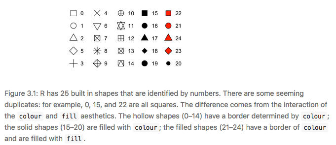
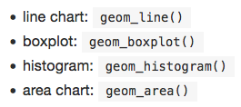

```{r setup, include=FALSE} 
# this chunk removes waring messages
knitr::opts_chunk$set(warning = FALSE, message = FALSE) 
```

Here are the examples, my notes, and exercises for chapter 3 of the free online book [R for Data Science](https://r4ds.had.co.nz/index.html), by Hadley Wickham and Garret Grolemund. 


```{r}
library(tidyverse)
library(gridExtra) # grid.arrange
mpg
```

**displ** : a cars engine size in litres

**hwy** : a car's fuel efficiency on the highway in mpg. 

```{r}
ggplot(data = mpg) + 
  geom_point(mapping = aes(x = displ, y = hwy))
```

* negative relation b/t engine size and fuel efficiency. 

* The mapping argument is always paried with aes(), and the x and y arguments of aes() specify which variables to map to the x and y axes. 

# 3.2.4 Exercises 

1. An empty square is made with the following code. 
```{r}
ggplot(data = mpg)
```

2. There are 234 rows and 11 columns in mpg. 

3. drv is the type of drive. i.e. f = front wheel, r = rear wheel, 4 is 4 wheel drive. 

4. This plot isn't useful because it is obvious as the number of cylinders increases the miles per gallon decreases. 
```{r}
ggplot(mpg) +
  geom_point(aes(x = cyl, y = hwy))
```

5. This isn't a useful plot because no obvious trends are being shown because there aren't a lot of data points. Categorical variables usually have a small number of values they are limited to, so it only seems like there are 12 values observed. 
```{r}
ggplot(mpg) +
  geom_point(aes(x = drv, y = class))
```

--- 

```{r}
ggplot(data = mpg) + 
  geom_point(mapping = aes(x = displ, y = hwy, color = class))
```

* can use color or colour

```{r}
ggplot(data = mpg) + 
  geom_point(mapping = aes(x = displ, y = hwy, size = class))
#> Warning: Using size for a discrete variable is not advised.

# Left
ggplot(data = mpg) + 
  geom_point(mapping = aes(x = displ, y = hwy, alpha = class))

# Right
ggplot(data = mpg) + 
  geom_point(mapping = aes(x = displ, y = hwy, shape = class))

# make all points blue
ggplot(data = mpg) + 
  geom_point(mapping = aes(x = displ, y = hwy), color = "blue")
```

<center>  </center>

# Exercises 3.3.1

1. The following code is incorrect because color is inside aes() so it is calling labeling all those points as "blue". 
```{r}
ggplot(data = mpg) + 
  geom_point(mapping = aes(x = displ, y = hwy, color = "blue"))
```

2. Categorical : manufacturer, model name, trans, drv, fl, and class <br> Continuous : displ, cty, year of manufacture, number of cylinders, and hwy

* notice in the printed data frame the categorical variables are usually <chr> where continuous are <int> or <double> 

3. 
```{r}
ggplot(data = mpg) + 
  geom_point(mapping = aes(x = displ, y = manufacturer, color = hwy))
ggplot(data = mpg) + 
  geom_point(mapping = aes(x = displ, y = manufacturer, size = hwy))
# error : continuous variable can not be mapped to shape
# ggplot(data = mpg) + 
#   geom_point(mapping = aes(x = displ, y = manufacturer, shape = hwy))
```

4. 
```{r}
ggplot(data = mpg) + 
  geom_point(mapping = aes(x = displ, y = hwy, color = hwy, size = displ))
ggplot(data = mpg) + 
  geom_point(mapping = aes(x = displ, y = hwy, size = hwy, color = displ))
```

5. Stroke adjusts the thickness of the boarder (for shapes 21-25). 

```{r}
ggplot(mtcars, aes(wt, mpg)) +
  geom_point(shape = 21, colour = "black", fill = "pink", size = 5, stroke = 5)
```


6. When defining something like color to be displ < 5, it sets up a true or false argument for this, and applies one color (blue) to true values less than 5 and red for false values greater than 5. 
```{r}
ggplot(data = mpg) + 
  geom_point(mapping = aes(x = displ, y = hwy, color = displ < 5))
```

---

```{r}
ggplot(data = mpg) + 
  geom_point(mapping = aes(x = displ, y = hwy)) + 
  facet_wrap(~ class, nrow = 2)
```

* to facet on the combination of two variables add facet_grid()

```{r}
ggplot(data = mpg) + 
  geom_point(mapping = aes(x = displ, y = hwy)) + 
  facet_grid(drv ~ cyl)
```

* can also use + facet_grid(.~cyl) to not facet in rows or column dimension 

# Exercises 3.5.1

1. When you facet a continuous variable you make A LOT of graphs. 
```{r}
ggplot(data = mpg) + 
  geom_point(mapping = aes(x = displ, y = hwy)) + 
  facet_wrap(~ hwy)
```

2. The empty cells in the facet_grid(drv ~ cyl) plot above are showing the empty points in the graph below. For example cars with four wheel drive only have an even number of cylinders so the plot of 4 wheel drive with 5 cylinders is empty because it does not exist. 
```{r}
ggplot(data = mpg) + 
  geom_point(mapping = aes(x = drv, y = cyl))
```

3. One of the below plots is shown in rows and the other in columns. The period says not to facet the rows or the columns. 
```{r}
ggplot(data = mpg) + 
  geom_point(mapping = aes(x = displ, y = hwy)) +
  facet_grid(drv ~ .)

ggplot(data = mpg) + 
  geom_point(mapping = aes(x = displ, y = hwy)) +
  facet_grid(. ~ cyl)
```

4. The advantages of facet wrap allow for data that has various classes or types to be analyzed by that and then easily compare the shape of the data to other the shape of other types or classes. Additionally it's difficult for humans to visualize a large amount of color so it is easier to digest the variety of date spread out. <br>The disadvantage of this could be that spreading the data out would make it difficult to compare observations between different categories.  
```{r}
ggplot(data = mpg) + 
  geom_point(mapping = aes(x = displ, y = hwy)) + 
  facet_wrap(~ class, nrow = 2)
```

5. nrow and ncol define the number of rows and columns in the facet wrap.There is also scales, shrink, labeler, as.table, switch, drop, dir, and stip.position. Facet grid doesn't have these because it is specified in the function instead.  

6. Variables with more unique levels should be in columns when using facet_grid() because there is more space for columns if the plot is laid out horizontally.  

--- 

```{r}
# left
a <- ggplot(data = mpg) + 
  geom_point(mapping = aes(x = displ, y = hwy))


b <- ggplot(data = mpg) + 
  geom_smooth(mapping = aes(x = displ, y = hwy))

grid.arrange(a,b, nrow = 1)

ggplot(data = mpg) + 
  geom_smooth(mapping = aes(x = displ, y = hwy, linetype = drv))
```
```{r}
c <- ggplot(data = mpg) +
  geom_smooth(mapping = aes(x = displ, y = hwy))
              
d <- ggplot(data = mpg) +
  geom_smooth(mapping = aes(x = displ, y = hwy, group = drv))
    
e <- ggplot(data = mpg) +
  geom_smooth(
    mapping = aes(x = displ, y = hwy, color = drv),
    show.legend = FALSE)
grid.arrange(c,d,e, nrow = 1)
```

```{r}
f <- ggplot(data = mpg) + 
  geom_point(mapping = aes(x = displ, y = hwy)) +
  geom_smooth(mapping = aes(x = displ, y = hwy))

g <- ggplot(data = mpg, mapping = aes(x = displ, y = hwy)) + 
  geom_point() + 
  geom_smooth()
  
grid.arrange(f,g, nrow = 1)
```
```{r}
# global mapping
h <- ggplot(data = mpg, mapping = aes(x = displ, y = hwy)) + 
  geom_point(mapping = aes(color = class)) + 
  geom_smooth()

# subcompact (subset) mapping
i <- ggplot(data = mpg, mapping = aes(x = displ, y = hwy)) + 
  geom_point(mapping = aes(color = class)) + 
  geom_smooth(data = filter(mpg, class == "subcompact"), se = FALSE)

grid.arrange(h,i, nrow =1)
```

# Exercises 3.6.1

1. 

2. Prediction that this graph will show the various smooth lines for drv without any standard error. 

```{r}
ggplot(data = mpg, mapping = aes(x = displ, y = hwy, color = drv)) + 
  geom_point() + 
  geom_smooth(se = FALSE)
```

3. show.legend = FALSE hides the legend box, and was used earlier in this chapter because it changes the size of the graphs, which would make it more difficult to compare to the other graphs. 


